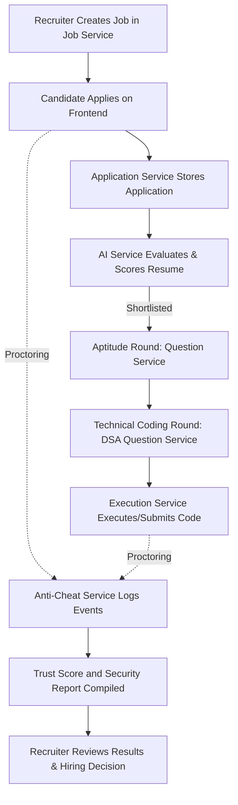

# AI Hiring Platform

An end-to-end, microservice-based hiring platform featuring AI resume parsing, candidate scoring, proctored assessments (aptitude, SQL, and DSA coding challenges), and secure code execution.

---

## Architecture & Microservices

The platform consists of several Spring Boot and FastAPI microservices orchestrated via an API Gateway.

### Services Registry & Ports

| Service | Port | Language/Framework | Purpose |
| :--- | :--- | :--- | :--- |
| `gateway-service` | 8080 | Java / Spring Cloud | Central entry point and CORS routing hub |
| `auth-service` | 8083 | Java / Spring Boot | Recruiter and candidate JWT authentication & login |
| `job-service` | 8081 | Java / Spring Boot | Job creation, description hosting, and assessment configurations |
| `application-service` | 8082 | Java / Spring Boot | Candidate application flow and assessment round orchestration |
| `resume-checker-service`| 8084 | Conceptual | Legacy fallback service for basic resume keyword screening |
| `ai-service` | 8085 | Python / FastAPI | Advanced AI resume parser, keyword scoring, and interview question generator |
| `question-service` | 8086 | Python / FastAPI | Aptitude test bank and Gemini-powered dynamic question generation |
| `dsaquestionservice` | 8087 | Python / FastAPI | DSA and SQL coding question banks and assignment engine |
| `anti-cheat-service` | 8088 | Java / Spring Boot | Proctoring session manager logging user events (e.g., tab focus/blur) and calculating candidate Trust Scores |
| `execution-service` | 8090 | Python / FastAPI | Sandboxed execution engine running candidate code submissions against test cases |
| `frontend` | 3000 | JavaScript / React | Recruiter dashboards and candidate application/test interface |

---

## End-to-End Application & Assessment Flow



1. **Recruiter Job Posting**: The recruiter creates a job post containing experience requirements, job descriptions, and assessment settings in `job-service`.
2. **Candidate Application**: The candidate submits their profile and uploads their resume via the `frontend`.
3. **Resume Scoring & Evaluation**: The `application-service` stores the application, then calls the `ai-service` for advanced parsing, experience check, and skills scoring (falling back to `resume-checker-service` if necessary).
4. **Shortlisting & Stage Promotion**: Shortlisted candidates move forward into the assessment funnel.
5. **Aptitude Round**: Candidate takes an aptitude test. The frontend fetches questions from `question-service` (seeded locally or generated dynamically using Gemini).
6. **Technical Coding Round**: Candidates solve DSA and SQL coding challenges. The frontend fetches questions from `dsaquestionservice`.
7. **Sandboxed Code Execution**: When candidate runs or submits code, the frontend calls the `execution-service`, which evaluates the solution against test cases.
8. **Anti-Cheat Monitoring (Proctoring)**: Throughout the test sessions, proctoring events (such as tab switches, fullscreen escapes, or window blurs) are recorded by `anti-cheat-service` to output a final Trust Score and Security Report.
9. **Hiring Decision**: The recruiter reviews the consolidated scorecards (assessment performance + Trust Score report) on their dashboard.

---

## Important Documentation Links

- [gateway-service/README.md](gateway-service/README.md)
- [auth-service/README.md](auth-service/README.md)
- [job-service/README.md](job-service/README.md)
- [application-service/README.md](application-service/README.md)
- [ai-service/README.md](ai-service/README.md)
- [question-service/README.md](question-service/README.md)
- [AI_SERVICE_INTEGRATION.md](AI_SERVICE_INTEGRATION.md)
- [frontend/README.md](frontend/README.md)

---

## Suggested Local Startup Order

1. **MySQL Database**: Ensure your database is running.
2. **API Gateway**: Start `gateway-service`.
3. **Authentication**: Start `auth-service`.
4. **Core Domain Services**: Start `job-service`.
5. **Aptitude/Resume Intelligence**: Start `ai-service` and `question-service`.
6. **DSA / SQL Services**: Start `dsaquestionservice` and `execution-service`.
7. **Security/Proctoring Service**: Start `anti-cheat-service`.
8. **Orchestrator**: Start `application-service`.
9. **UI**: Start the `frontend` server.

---

## Quick Run Examples

### 1. Spring Cloud API Gateway
```powershell
Set-Location C:\Users\ADMIN\Desktop\ai-hiring-platform\gateway-service
mvn spring-boot:run
```

### 2. Job Service
```powershell
Set-Location C:\Users\ADMIN\Desktop\ai-hiring-platform\job-service
mvn spring-boot:run
```

### 3. Application Service
```powershell
Set-Location C:\Users\ADMIN\Desktop\ai-hiring-platform\application-service
mvn spring-boot:run
```

### 4. Anti-Cheat / Proctoring Service
```powershell
Set-Location C:\Users\ADMIN\Desktop\ai-hiring-platform\anti-cheat-service
mvn spring-boot:run
```

### 5. Aptitude Question Service
```powershell
Set-Location C:\Users\ADMIN\Desktop\ai-hiring-platform\question-service
& ..\.venv\Scripts\Activate.ps1
python -m uvicorn main:app --host 0.0.0.0 --port 8086 --reload
```

### 6. DSA & SQL Question Service
```powershell
Set-Location C:\Users\ADMIN\Desktop\ai-hiring-platform\dsaquestionservice
& ..\.venv\Scripts\Activate.ps1
python -m uvicorn main:app --host 0.0.0.0 --port 8087 --reload
```

### 7. Code Execution Service
```powershell
Set-Location C:\Users\ADMIN\Desktop\ai-hiring-platform\execution-service
& ..\.venv\Scripts\Activate.ps1
python -m uvicorn main:app --host 0.0.0.0 --port 8090 --reload
```

### 8. Frontend React Application
```powershell
Set-Location C:\Users\ADMIN\Desktop\ai-hiring-platform\frontend
npm run dev
```
